# Design 101
### *with Aly Fluckey*

---

## 1. Plan
### *at least a little bit*

---

# intent

^ think about the intent of the product
creative and fun?
modern and sophisticated?
every design decision you make should be informed by the intent
donut site vs spinning cat example

---

### *intent*
# content

^ content first
be thinking about different ways to deliver content
keep it simple
think about layout and flow

---

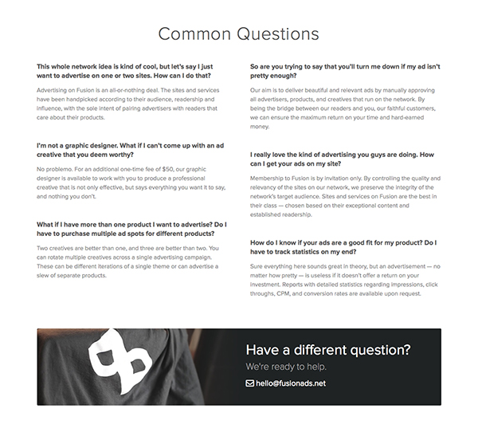

--- 

### *intent*
### *content*
# hierarchy

^ we want to display all of the different elements in our design effectively
how important are they?
what level of focus or attention should be placed on them? 
^
Hierarchy is also about storytelling; it’s about our user’s journey through the website and the user flow we create
--Rachel Shillcock
shopping cart example - make the path to checkout top priority 

---

# some ways to help establish hierarchy

- color & contrast
- size
- alignment
- repetition
- whitespace

---

## sketch

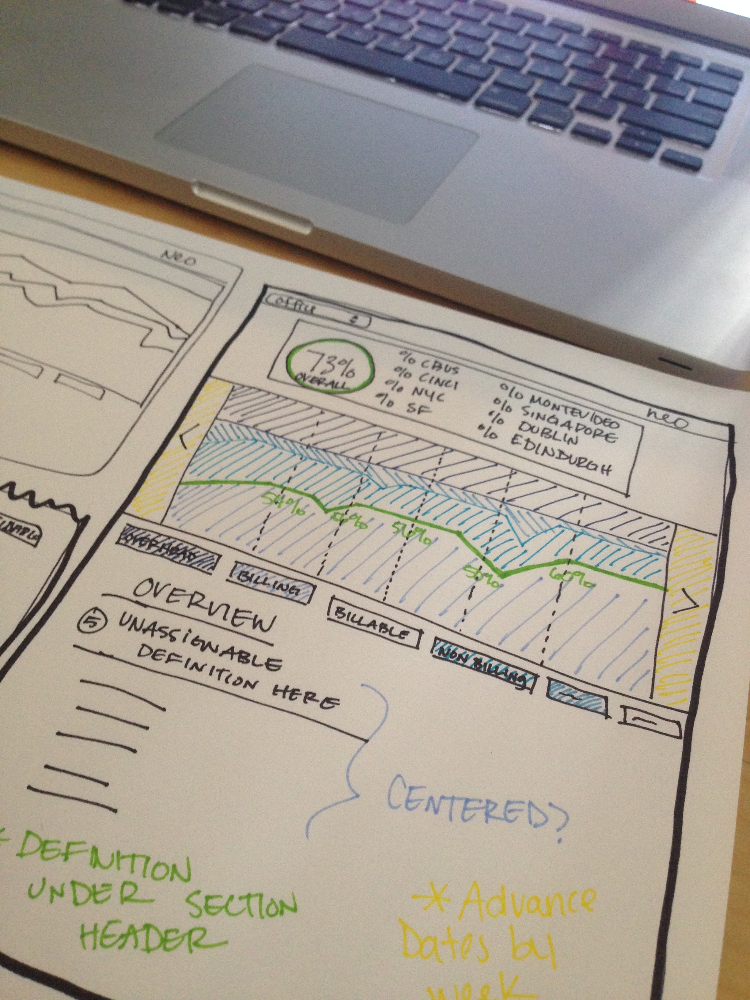

^ if you need help visualizing what you're trying to communicate, sketch, especially in groups
whiteboards are your friend
go to web for balsamiq example

---

## 1. Plan
### *at least a little bit*

## 2. Iterate
### *a lot*

^ all of this planning will pay off once you start building
i recently found that I personally like to build the foundation of a design first and then work on the details like color and type

---

# *color*

---

the basics 

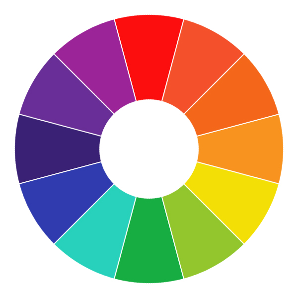

---

primary

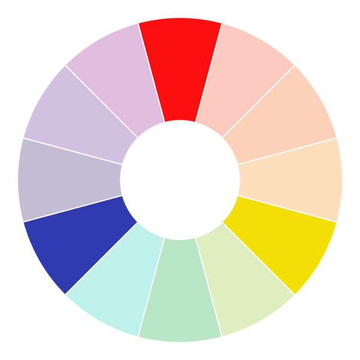

red, blue and yellow

---

secondary

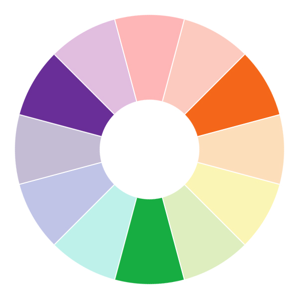

green, purple and orange

---

tertiary 

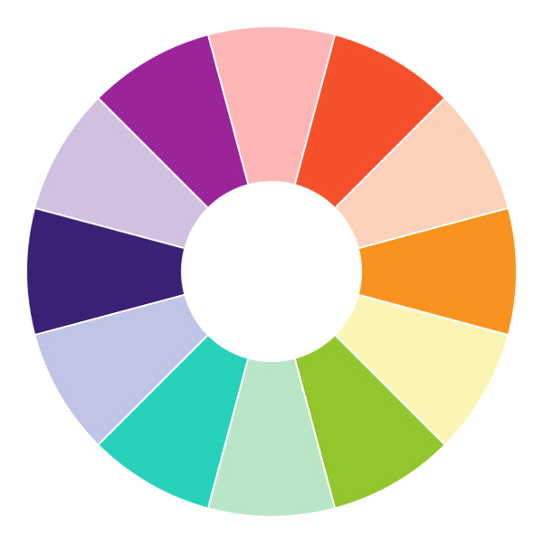

basically all other colors

---

warm family

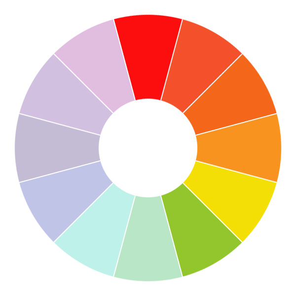

---

cool family

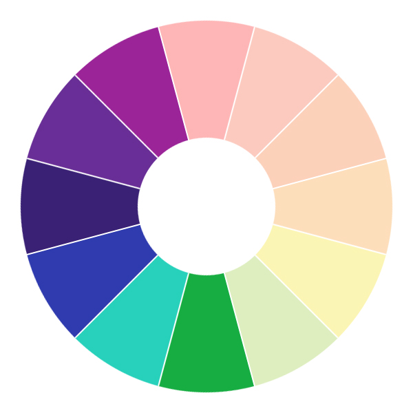

---

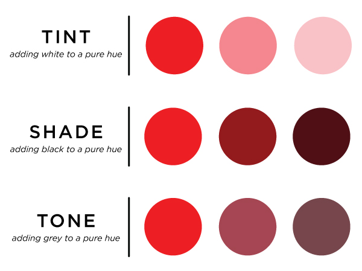

^ hue - color itself (red)
  tint - white
  shade - black
  tone - grey
  opinions on lots of pure white and black

---

## emotions

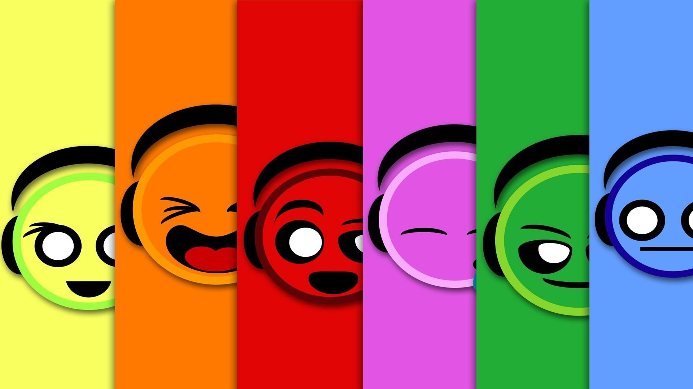

---

## Choosing a *color* scheme
^ i tend to gravitate toward the same colors every time (cuz they're my favs), so sometimes it's a nice challenge to choose a color scheme I don't actually like and see if I can make it work

---

# *type*

---


---

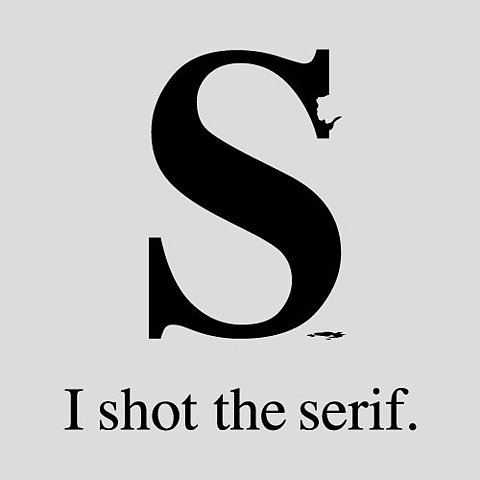

---

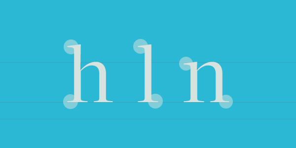

^ serif fonts have the little feet (embellishments)
more classic
easier to read in print

---

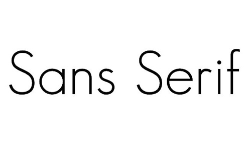

^ sans-serif fonts don't have the feet
more modern
easier to read on web

---

### so which one do I use? 

---

### one size does not fit all

### *but here are some suggestions*

---

- Don't use more than 3 fonts on a single page

---

- Don't switch fonts mid-sentence unless you have a very good reason

---

- Use sans-serif fonts for online body text and serif fonts for headlines and print

^ show examples of wikipedia vs medium

---

- Use monospace fonts for typewriter text and code blocks

```
def like_this
	puts 'I am code'
end
```

---

- Use script and fantasy fonts for accents

---

## *Finding the perfect font*

---

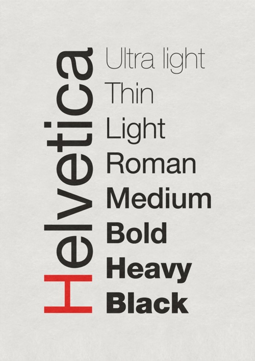
# font families

^ to web - google fonts, fontsquirrel (hosting), and typecast

---

## Font Icons

^ to fontawesome

---

## Responsive design

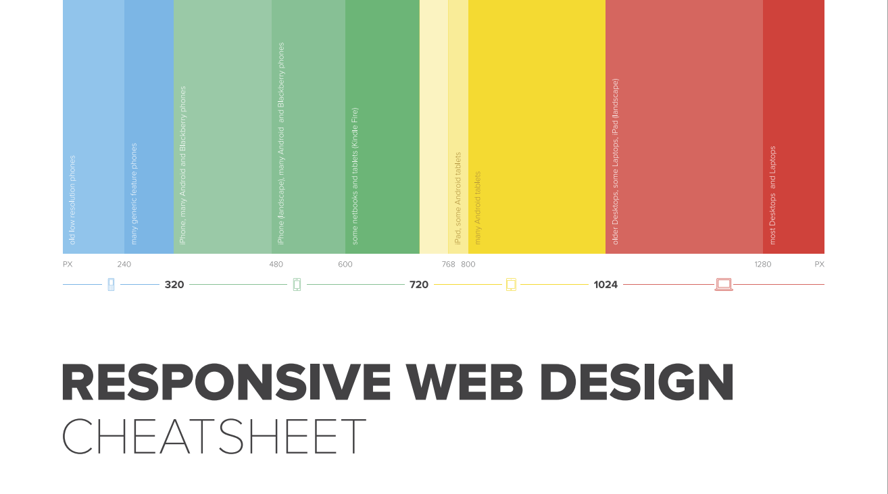


^ important to make sure that everything looks good on smaller screens
- chrome responsive emulator

---

``` css
@media screen and (max-width: 1280px) {

	.desktop-to-tablet-class {
		width: 75%;
		margin: auto;
	}
}

@media screen and (max-width: 768px) {

	.tablet-to-mobile-class {
		width: 85%;
		margin: auto;
	}
}

@media screen and (max-width: 320px) {

	.mobile-and-below-class {
		width: 100%;
	}
}
```


^ *remember to include your responsive stylesheet AFTER your base stylesheet or you're gonna have a bad time

---

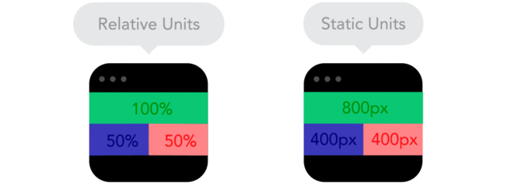

### use relative units

^ percentages instead of static widths (pixels)

---

# The Inspector
## *your best friend*

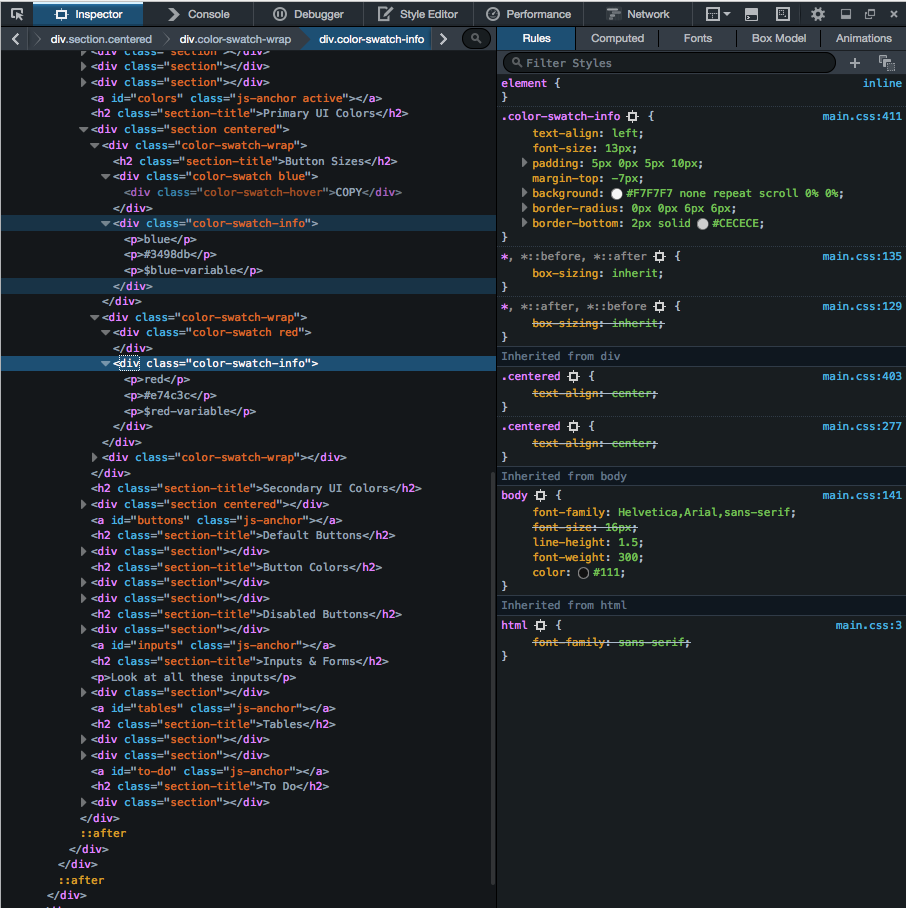

---

## CSS Animations


---

### 1. Plan
### *at least a little bit*

### 2. Iterate
### *a lot*

### 3. Profit
### *$$$$$$$$*


---

# *Thank you!*
